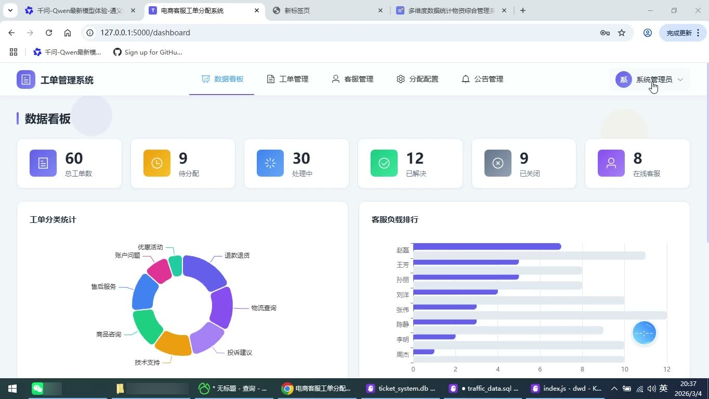
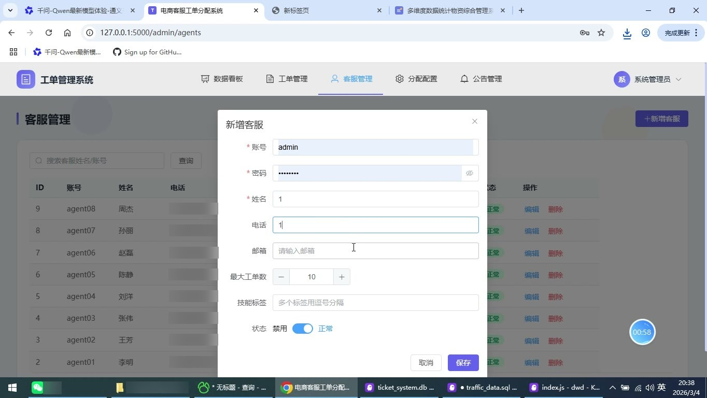
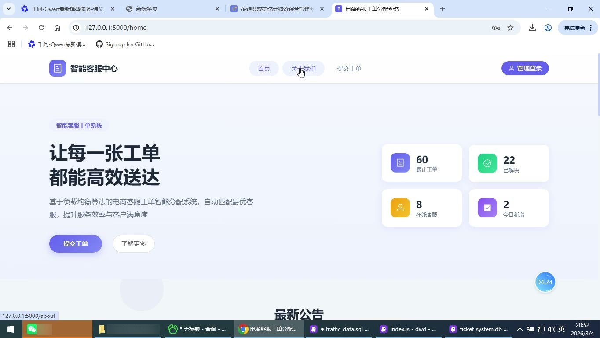
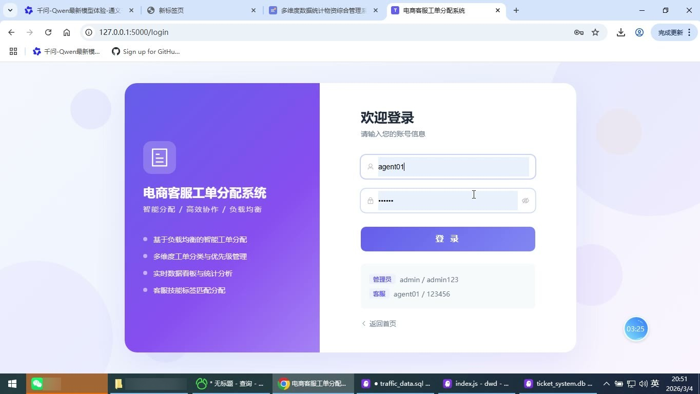
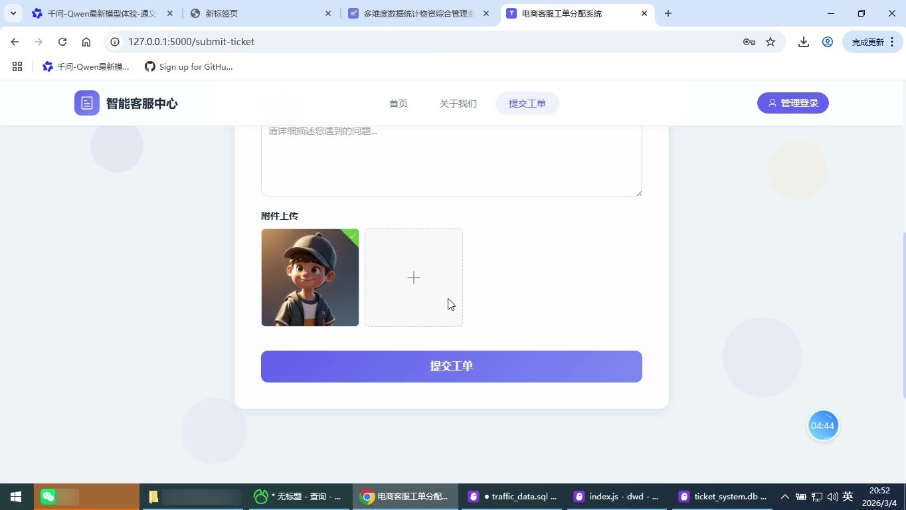
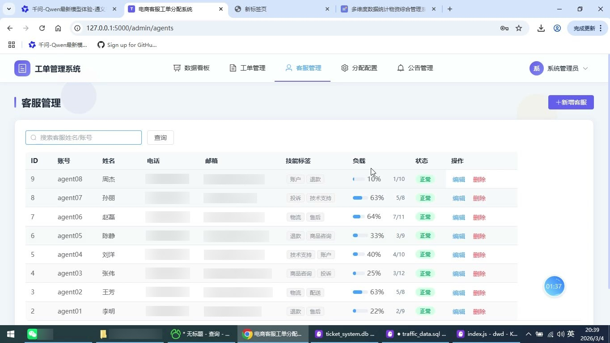

# (附文档)Python+Flask+Vue3 电商客服工单分配系统

**技术栈**：Python、Flask、Vue3

### 系统简介

本系统是一套前后端分离的电商客服工单分配平台，后端基于 Python Flask 提供 RESTful 接口，前端基于 Vue3 构建单页应用，数据层采用 SQLite 持久化。系统包含普通用户（前台访客）、管理员、客服三种角色，围绕工单的提交、智能分配、处理流转、数据统计形成完整闭环。
 
### 核心功能
 
### 普通用户端

 
- 浏览首页：展示累计工单、已解决工单、在线客服、今日新增等实时统计卡片。 
- 查看轮播公告：首页以轮播形式展示后台启用的公告标题与内容。 
- 浏览服务类型：展示退款退货、物流查询、商品咨询、账户问题、投诉建议、技术支持、售后服务、优惠活动八类服务说明。 
- 查看系统特点：展示智能负载均衡、技能标签匹配、优先级调度、实时数据看板、灵活配置规则、Excel 数据导出等介绍。 
- 查看关于页：展示系统背景、核心功能、设计目标、技术优势及工单处理流程四步骤。 
- 提交工单：填写姓名、联系电话、问题类型、优先级、问题标题与详细描述。 
- 上传附件：支持上传最多 3 张图片，单张不超过 5MB，作为工单附件提交。 
- 获取工单编号：提交成功后弹窗展示系统生成的工单编号与提示信息。 
- 动态加载问题类型：提交页的问题类型选项由后台分类接口实时返回。
 
### 管理员端

 
- 数据看板：展示总工单数、待分配、处理中、已解决、已关闭、在线客服六项统计卡片。 
- 工单分类统计：以环形饼图展示各分类工单数量占比。 
- 客服负载排行：以横向柱状图对比每位客服的当前负载与最大容量。 
- 近 7 天工单趋势：以平滑面积折线图展示每日工单新增数量。 
- 优先级分布：以饼图展示低、中、高三个优先级的工单占比。 
- 客服管理：按姓名或账号搜索客服，分页查看账号、姓名、电话、邮箱、技能标签、负载进度与状态。 
- 新增客服：录入账号、密码、姓名、电话、邮箱、最大工单数与技能标签，并设置启用状态。 
- 编辑客服：修改客服资料、最大工单数与技能标签，密码留空则不修改。 
- 删除客服：对指定客服执行删除操作并二次确认。 
- 工单管理：按关键字、状态、分类筛选工单，分页查看工单号、标题、客户、分类、优先级、状态、客服与创建时间。 
- 手动分配工单：对待分配或已分配状态的工单选择在线客服进行指派，下拉展示客服当前负载。 
- 关闭工单：对未关闭的工单执行关闭操作。 
- 删除工单：对指定工单执行删除并二次确认。 
- 新建工单：由管理员代客户录入客户姓名、电话、分类、优先级、标题与描述。 
- 查看工单详情：展示工单号、状态、标题、分类、客户、客服、描述、解决方案及操作日志时间轴。 
- 导出工单：一键将工单列表导出为 Excel 文件，含工单号、标题、客户、分类、优先级、状态、客服、创建时间。 
- 分配配置：在线编辑 assign_mode、max_retry、auto_assign、priority_weight 等分配参数并保存。 
- 公告管理：新增、编辑、删除公告，支持标题、内容、图片上传、排序值与启用状态设置。
 
### 客服端

 
- 我的工单统计：展示总工单、待处理、已解决、已关闭四项个人统计卡片。 
- 工单列表：按状态筛选并分页查看分配给自己的工单号、标题、客户、分类、优先级、状态与创建时间。 
- 查看工单详情：展示工单号、状态、标题、分类、客户、电话、描述、解决方案及操作日志时间轴。 
- 开始处理：将已分配状态的工单变更为处理中。 
- 解决工单：在弹窗中填写解决方案后，将处理中工单标记为已解决。 
- 个人中心：查看账号、姓名、角色、邮箱、电话、技能标签与工单负载信息。 
- 修改密码：输入原密码、新密码与确认密码完成密码变更，含一致性校验。
 
### 技术栈

 后端框架Python + Flask 跨域与鉴权Flask-CORS + JWT Token 鉴权 数据库SQLite 前端框架Vue 3（Composition API） 前端路由Vue Router（含登录与角色路由守卫） 状态管理Pinia（user store） UI 组件库Element Plus 数据可视化ECharts 表格导出SheetJS（xlsx） 样式方案SCSS
 
### 交付内容

 
- 后端完整源码 
- 前端完整源码 
- 数据库初始化脚本 
- 万字文档

## 界面展示

---

## 获取完整源码 + 万字文档

本仓库为项目介绍页。**完整前后端源码、数据库初始化脚本、万字项目文档**，请加微信 `kangkangcode`，或访问 [codekk.top](http://codekk.top) 获取。

可作课程设计 / 毕业设计参考，支持远程部署调试。